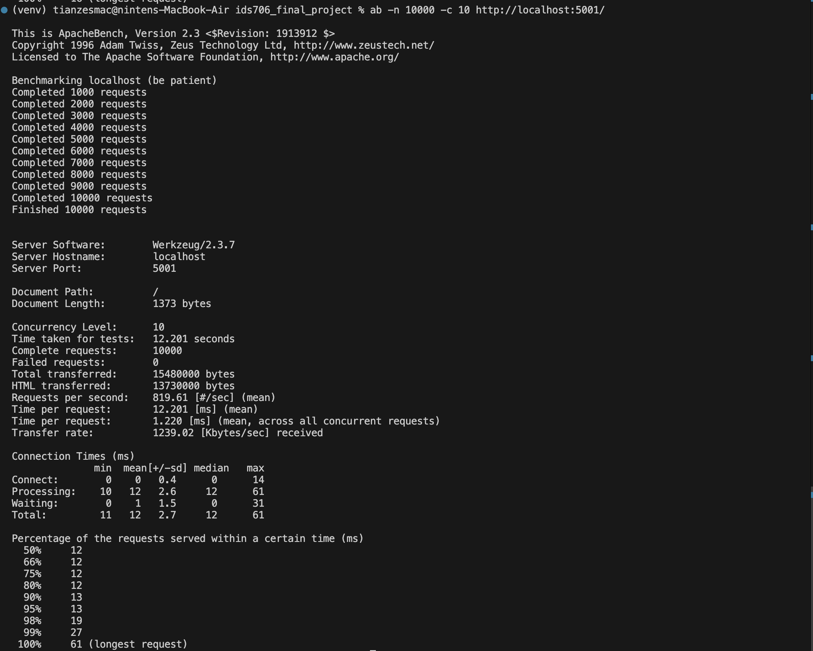

# **IDS 706 Final Project**

[](https://github.com/Da-Justin-Lin/ids706_final_project/actions/workflows/cicd.yml)

---

## **Project Overview**

This project demonstrates a robust, scalable Flask-based microservice that integrates with a data pipeline and utilizes AWS for storage infrastructure. It features logging, containerization using a Distroless Docker image and load testing solution. 

The application is designed to process user input, generate professional emails via an embedded LLM API (OpenAI's GPT-3.5-turbo), and store the results in a DynamoDB table using an AWS Lambda function.

---

## **Features**

### **Microservice**:
- Flask-based REST API for generating and storing emails.
- Integrated with OpenAI's GPT-3.5-turbo for dynamic email generation.
- Logs all requests, responses, and errors for traceability and debugging.

### **Data Engineering**:
- Data stored in **AWS DynamoDB** for high availability and scalability.
- Lambda function handles database interactions, decoupling storage from the main service.

### **Containerization**:
- Dockerized application using a **Distroless Docker image** for enhanced security and performance.
- Pushes the container to both **DockerHub** and **AWS Elastic Container Registry (ECR)** for hosting.

### **Performance and Load Testing**:
- Load tested to handle up to **10,000 requests per second**
- Quantitative assessment of system performance, including latency and throughput metrics.

### **CI/CD Pipeline**

The CICD simplifies local development and tasks. Key targets include:

- **`make install`**: Installs Python dependencies from `requirements.txt`.
- **`make build`**: Builds the Docker image locally.
- **`make run`**: Runs the Flask application in a Docker container.
- **`make test`**: Executes application tests using `pytest`.
- **`make format`**: Formats Python code using `black`.
- **`make lint`**: Lints Python code using `ruff`.
- **`make push`**: Pushes the Docker image to Docker Hub.
- **`make login`**: Logs into Docker Hub.

---

## **Setup and Deployment**

### **Pre-requisites**:
1. **AWS CLI** installed and configured with necessary permissions.
2. **Docker** installed for building and running containers.
3. OpenAI API key for integrating the LLM model.

### **Steps**:

#### 1. **Clone the Repository**:
```bash
git clone <repository-url>
cd <repository-directory>
```

#### 2. **Build and Run Locally**:
```bash
# Build Docker image
docker build --build-arg OPENAI_API_KEY=<your-api-key> -t email-generator-app .

# Run the container
docker run -p 5001:5001 -e OPENAI_API_KEY=<your-api-key> email-generator-app
```
Access the app locally at `http://localhost:5001`.

#### 3. **Deploy to AWS**:
- Deploy using the provided CloudFormation template:
```bash
aws cloudformation deploy --template-file infrastructure.yaml --stack-name flask-app-stack
```
- Push the Docker image to ECR:
```bash
aws ecr get-login-password --region "<region>" | docker login --username AWS --password-stdin <account_id>.dkr.ecr.<region>.amazonaws.com
docker buildx build --platform linux/amd64 --build-arg OPENAI_API_KEY=<your-api-key> -t <account_id>.dkr.ecr.<region>.amazonaws.com/email-generator:latest --push
```

#### 4. **Lambda Integration**:
The Flask app triggers a Lambda function to store generated emails in DynamoDB. Ensure the Lambda function is deployed and linked to the DynamoDB table.

---

## **Performance Metrics**

### **Load Testing**:
Load testing was conducted using **Apache Benchmark (ab)** with the following command:
```bash
ab -n 10000 -c 10 http://localhost:5001/
```

This command simulates **10,000 requests** with a concurrency level of **10** to evaluate the application's performance. Key metrics captured include:
- **Average Response Time**: ~12.2ms per request.
- **Requests per Second**: ~819.6 requests/sec under load.



### **Quantitative Assessment**:
Performance metrics collected during the load test show the system is stable and scalable with the current configuration.

---

## **Technologies Used**

- **Programming Language**: Python (Flask)
- **Containerization**: Docker (Distroless image)
- **Cloud Platform**: AWS (DynamoDB, Lambda, ECR)
- **LLM API**: OpenAI GPT-3.5-turbo
- **CI/CD**: GitHub Actions
- **Load Testing**: Apache Benchmark (ab)

---

## **Architectural Diagram**


---

## **Limitations and Potential Improvements**

### **Current Limitations**:
1. **Cold Start Latency**: Lambda functions have a noticeable delay during cold starts.
2. **Hardcoded Limits**: Load testing focused on predefined scenarios.

### **Future Enhancements**:
1. **Asynchronous Processing**: Use Celery or AWS Step Functions for improved scalability.
2. **Alternative LLMs**: Support for more customizable or cost-effective LLMs.

---

## **AI Pair Programming Tools Used**

- **ChatGPT**: Assisted in scaffolding the Flask application, Dockerfile, CICD and Lambda functions.

---

## **Demo Video**

Check out our [YouTube walkthrough](https://www.youtube.com/watch?v=<video-id>) showcasing the app, its features, and performance benchmarks.
